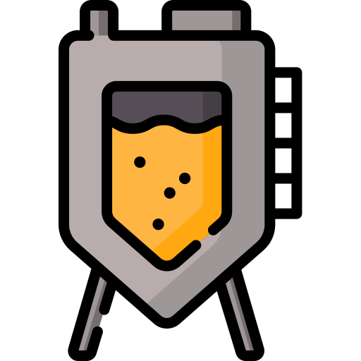

# BioFerm

A web application for the kinetic modelling and estimation of kinetic parameters in bioreactors
***
##### Mentee: Olayile Ejekwu
##### Mentor: Renato Alves
---

# MOTIVATION

- Matlab -- Expensive
- Python & Excel -- Learning curve
- BioFerm -- Easy to use interface 
***

---

---
<section data-auto-animate>

---

---

---

---

---

# OLS outcome

- Openness of project
- Specified a target audience 
- Workable prototype
- More organized and project management skills
- Github Skills
---

## PROBLEMS
- Hosting online or finding an easy way to download

## Next step
- Feedback from early users on the prototype
- Instructional videos on how to use
- Add more models 
- Add other minimizers for parameter estimation
- Expand on Github ReadMe

---
## Thank You
Repo: https://github.com/Olayile/Bioprocess-tool
Instagram: https://www.instagram.com/bioferm_innovations
Email: olayileejekwu@gmail.com

